# Hello App Runner - Node.js 🚀

**This is the companion repository for the tutorial "[Enabling continuous workflows for AWS App Runner service with persistency using AWS Copilot CLI](https://aws.amazon.com/blogs/containers/enabling-continuous-workflows-for-aws-app-runner-service-with-persistency-using-aws-copilot-cli/)" on the AWS Containers blog.**

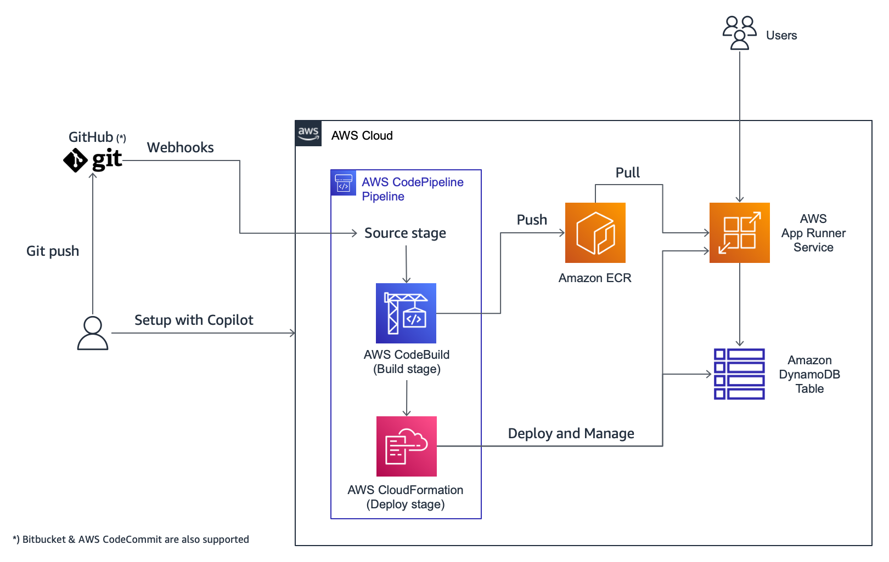

---

This repository contains a sample `Node.js` app and a simplified version of the [tutorial blog post](https://aws.amazon.com/blog/containers/enabling-continuous-workflows-for-aws-app-runner-service-with-persistency-using-aws-copilot-cli), to let you deploy and run it on [AWS App Runner](https://aws.amazon.com/apprunner/) with [Amazon DynamoDB](https://aws.amazon.com/dynamodb/). The sample app will be built and deployed via a configurable pipeline created in [AWS CodePipeline](https://aws.amazon.com/codepipeline/).

You'll get an architecture like in the diagram below.

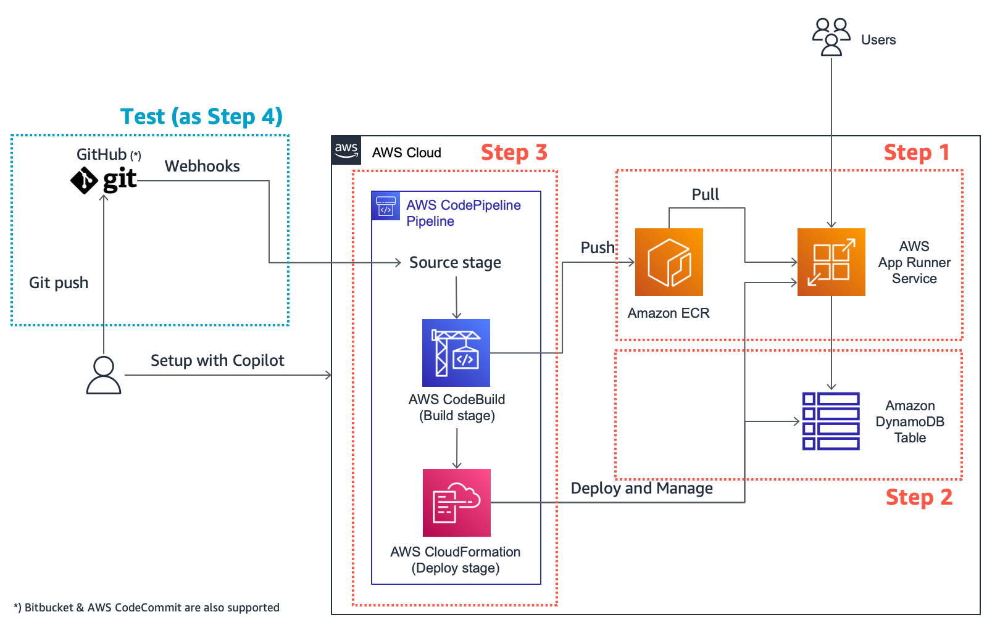

In step 1 and 2, we’re going to set up and deploy minimal required resources such as App Runner and DynamoDB to run the sample application. After that, we’ll have a configurable pipeline with AWS CodePipeline in step 3, then try "push-to-deploy" in step 4 to see all elements work together as expected. Beware that the tutorial may incur some charges especially for App Runner usage and DynamoDB table.

> Note that we use CodePipeline instead of App Runner’s built-in managed pipeline to show "how to deploy from Dockerfile" and "how to add tests in release pipeline" in this tutorial. If you’d like to try "deploy from source code" after the tutorial, follow [here](#in-case-you-also-want-to-try-app-runners-managed-pipeline) to use App Runner’s managed pipeline which supports Node.js and Python today.

## Building and deploying Next.js application on App Runner using Copilot CLI

### Prerequisites

- Copilot v1.7.1 or later
- Docker Desktop (or Docker Engine on Linux environment)
- AWS CLI v1 or v2
- `jq`
- **A [forked](https://github.com/aws-containers/hello-app-runner-nodejs/fork) GitHub repository**
  - You will need your own forked repository to try "push-to-deploy" in the step 4 of this tutorial, so ensure you're using a forked repo, which you're allowed to push.

### 0. Clone forked repo

```bash
$ git clone https://github.com/<Your GitHub ID>/hello-app-runner-nodejs

$ cd hello-app-runner-nodejs
```

### 1. Create Copilot application

If the Copilot binary is missing or is outdated, follow the [Copilot doc](https://aws.github.io/copilot-cli/docs/getting-started/install/) to install/update.

```bash
$ copilot --version
copilot version: v1.7.1 # Ensure you have v1.7.1 or later

$ copilot init
# NOTE:
## Choose "n" (No) if Copilot asked "Would you like to use one of your existing applications?"
## Then answer the Copilot's questions as follows
What would you like to name your application?: my-app
Which workload type best represents your architecture?: Request-Driven Web Service  (App Runner)
What do you want to name this Request-Driven Web Service?: my-svc
Which Dockerfile would you like to use for my-svc?: ./Dockerfile
```

<details>
  <summary>Show terminal outputs</summary>

```bash
Application name: my-app
Service name: my-svc
Dockerfile: ./Dockerfile
Ok great, we'll set up a Request-Driven Web Service named my-svc in application my-app listening on port 80.

✔ Created the infrastructure to manage services and jobs under application my-app.

✔ Wrote the manifest for service my-svc at copilot/my-svc/manifest.yml
Your manifest contains configurations like your container size and port (:80).

✔ Created ECR repositories for service my-svc.

All right, you're all set for local development.
```

</details>

#### 1-1. Provision "test" environment

At this point you'll be asked if you want to proceed to provision "test" environment. Choose "y" (Yes) to proceed.

Note that Copilot first creates an environment to hold shared infrastructure between services in a Copilot application. Although App Runner does not require a VPC or an Amazon Elastic Container Service (Amazon ECS) cluster, Copilot creates these free-of-charge resources by default. This makes it possible to for you have seamless workflows within the same environment across App Runner or Amazon ECS, whichever you chose for the compute.

```bash
# NOTE:
## Since this process is a one-time operation for each environment to create all the shared resources,
## it will take several minutes to complete.
Would you like to deploy a test environment?: y
```

<details>
  <summary>Show terminal outputs</summary>

```bash
Deploy: Yes

✔ Linking account <Your AWS account ID> and region <Your AWS region> to application my-app.
✔ Proposing infrastructure changes for the my-app-test environment.
- Creating the infrastructure for the my-app-test environment.           [create complete]  [77.3s]
  - An IAM Role for AWS CloudFormation to manage resources               [create complete]  [19.1s]
  - An ECS cluster to group your services                                [create complete]  [10.1s]
  - Enable long ARN formats for the authenticated AWS principal          [create complete]  [0.0s]
  - An IAM Role to describe resources in your environment                [create complete]  [16.9s]
  - A security group to allow your containers to talk to each other      [create complete]  [3.3s]
  - An Internet Gateway to connect to the public internet                [create complete]  [17.8s]
  - Private subnet 1 for resources with no internet access               [create complete]  [15.0s]
  - Private subnet 2 for resources with no internet access               [create complete]  [15.0s]
  - Public subnet 1 for resources that can access the internet           [create complete]  [15.0s]
  - Public subnet 2 for resources that can access the internet           [create complete]  [15.0s]
  - A Virtual Private Cloud to control networking of your AWS resources  [create complete]  [17.8s]
✔ Created environment test in region us-west-2 under application my-app.
Environment test is already on the latest version v1.4.0, skip upgrade.
[+] Building 57.9s (12/12) FINISHED
 => [internal] load build definition from Dockerfile
 => => transferring dockerfile: 40B
 => [internal] load .dockerignore
 => => transferring context: 34B
 => [internal] load metadata for docker.io/library/node:12
 => [auth] library/node:pull token for registry-1.docker.io
 => [1/6] FROM docker.io/library/node:12@sha256:e38a48c584fde720a43b1bacfea1178e0900936cb8d0141630e5e35693ee6d08
 => [internal] load build context
 => => transferring context: 39.09MB
 => CACHED [2/6] WORKDIR /app
 => CACHED [3/6] COPY package*.json ./
 => CACHED [4/6] RUN npm install
 => [5/6] COPY . .
 => [6/6] RUN npm run build
 => exporting to image
 => => exporting layers
 => => writing image sha256:d7a37ddb71b53cc87ae3822f0e9e417f0b2e9fa23e3618879a08d334211c6de4
 => => naming to <your AWS account ID>.dkr.ecr.<your AWS region>.amazonaws.com/my-app/my-svc

Use 'docker scan' to run Snyk tests against images to find vulnerabilities and learn how to fix them
Login Succeeded
Using default tag: latest
The push refers to repository [<your AWS account ID>.dkr.ecr.<your AWS region>.amazonaws.com/my-app/my-svc]
5e43bcce0ae2: Pushed
6858c871c249: Pushed
31aa9a1a0394: Pushed
9e30aae11a95: Pushed
f922dd0feff4: Pushed
390b35f36fa5: Pushed
f26dcd4a0423: Pushed
9271d99f30cd: Pushed
b257e69d416f: Pushed
1e9c28d06610: Pushed
cddb98d77163: Pushed
ed0a3d9cbcc7: Pushed
8c8e652ecd8f: Pushed
2f4ee6a2e1b5: Pushed
latest: digest: sha256:3a73cbda7313d2a248e0cab08fb2f91eeb1e94f6d9da30a9dfb77063c4459f8e size: 3266
✔ Proposing infrastructure changes for stack my-app-test-my-svc
- Creating the infrastructure for stack my-app-test-my-svc                        [create complete]  [343.5s]
  - An IAM Role for App Runner to use on your behalf to pull your image from ECR  [create complete]  [18.6s]
  - An IAM role to control permissions for the containers in your service         [create complete]  [16.3s]
  - An App Runner service to run and manage your containers                       [create complete]  [315.2s]
✔ Deployed my-svc, you can access it at https://<random string>.<your AWS region>.awsapprunner.com.
```

</details>

#### 1-2. Check deployed app in web browser

Open the endpoint of your App Runner service in your preferred web browser. You can find the endpoint url at the end of the previous command's output (it's in the form of https://<random string>.<your AWS region>.awsapprunner.com).

Once you opened it, you'll see the app failed to load data. This is because there is no DynamoDB table provisioned at this point.

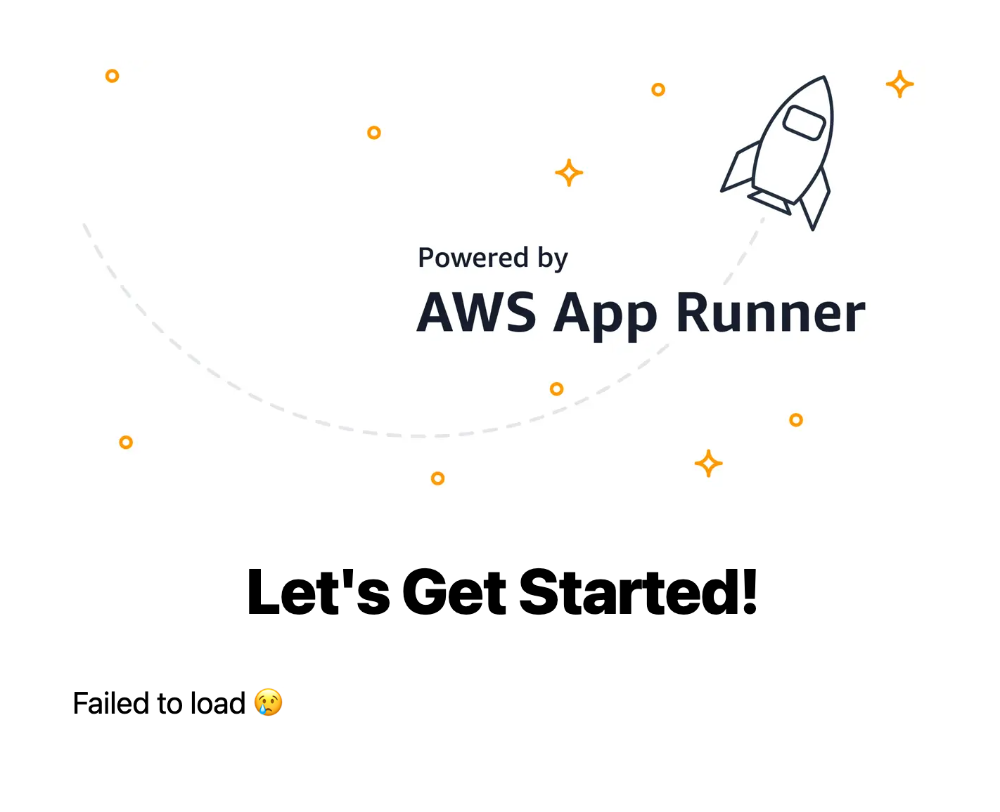

Okay then, let's set up a DynamoDB table in the next step.

### 2. Set up DynamoDB table

```bash
$ copilot storage init
What type of storage would you like to associate with my-svc?: DynamoDB (NoSQL)
What would you like to name this DynamoDB Table?: Items
What would you like to name the partition key of this DynamoDB?: ItemId
What datatype is this key?: String
Would you like to add a sort key to this table?: N
```

<details>
  <summary>Show terminal outputs</summary>

```bash
Only found one workload, defaulting to: my-svc
Storage type: DynamoDB
Storage resource name: Items
Partition key: ItemId
Partition key datatype: String
Sort key? No
✔ Wrote CloudFormation template for DynamoDB Table Items at copilot/my-svc/addons/Items.yml

Recommended follow-up actions:
- Update my-svc's code to leverage the injected environment variable ITEMS_NAME.
For example, in JavaScript you can write `const storageName = process.env.ITEMS_NAME`.
- Run `copilot deploy --name my-svc` to deploy your storage resources.
```

</details>

Before proceeding, it's helpful to understand that the command copilot storage init does not actually provision AWS resources, and it only creates configuration files in your local workspace, more specifically ./copilot/my-svc/addons/Items.yml in this case. So you will provision it using the copilot deploy command in the next step.
You may also realized at the end of the terminal output above, that your application will be able to refer the DynamoDB table name via an environment variable named `ITEMS_NAME` that Copilot will inject into your App Runner service automatically.

Then, let's provision the dependent resources (a DynamoDB table and an IAM role in this case) and update your service to use the new environment variable "ITEMS_NAME."

```bash
$ copilot deploy --name my-svc
```

<details>
  <summary>Show terminal outputs</summary>

```bash
Only found one environment, defaulting to: test
Environment test is already on the latest version v1.4.0, skip upgrade.
[+] Building 58.6s (12/12) FINISHED
 => [internal] load build definition from Dockerfile
 => => transferring dockerfile: 40B
 => [internal] load .dockerignore
 => => transferring context: 78B
 => [internal] load metadata for docker.io/library/node:12
 => [auth] library/node:pull token for registry-1.docker.io
 => [1/6] FROM docker.io/library/node:12@sha256:e38a48c584fde720a43b1bacfea1178e0900936cb8d0141630e5e35693ee6d08
 => [internal] load build context
 => => transferring context: 1.21MB
 => CACHED [2/6] WORKDIR /app
 => CACHED [3/6] COPY package*.json ./
 => CACHED [4/6] RUN npm install
 => [5/6] COPY . .
 => [6/6] RUN npm run build
 => exporting to image
 => => exporting layers
 => => writing image sha256:fa2bde89ceef586fb009e3ea5c1fb746e3c570752015641098a8a25b399dc535
 => => naming to <your AWS account ID>.dkr.ecr.<your AWS region>.amazonaws.com/my-app/my-svc

Use 'docker scan' to run Snyk tests against images to find vulnerabilities and learn how to fix them
Login Succeeded
Using default tag: latest
The push refers to repository [<your AWS account ID>.dkr.ecr.<your AWS region>.amazonaws.com/my-app/my-svc]
33783c942afd: Pushed
782e979b18c5: Pushed
31aa9a1a0394: Layer already exists
9e30aae11a95: Layer already exists
f922dd0feff4: Layer already exists
390b35f36fa5: Layer already exists
f26dcd4a0423: Layer already exists
9271d99f30cd: Layer already exists
b257e69d416f: Layer already exists
1e9c28d06610: Layer already exists
cddb98d77163: Layer already exists
ed0a3d9cbcc7: Layer already exists
8c8e652ecd8f: Layer already exists
2f4ee6a2e1b5: Layer already exists
latest: digest: sha256:d4ca0725c7404bdd22f3dd81399ce5dad8503bf550d8b5f3063161e26a7f2aed size: 3266
✔ Proposing infrastructure changes for stack my-app-test-my-svc
- Updating the infrastructure for stack my-app-test-my-svc                 [update complete]  [351.9s]
  - An Addons CloudFormation Stack for your additional AWS resources       [create complete]  [60.8s]
    - An IAM ManagedPolicy for your service to access the Items db         [create complete]  [15.7s]
    - An Amazon DynamoDB table for Items                                   [create complete]  [31.9s]
  - An IAM role to control permissions for the containers in your service  [update complete]  [15.6s]
  - An App Runner service to run and manage your containers                [update complete]  [261.7s]
✔ Deployed my-svc, you can access it at https://<random string>.<your AWS region>.awsapprunner.com.
```

</details>

#### 2-2. Seed initial data into the DynamoDB table

The provisioned DynamoDB table is still empty of course, so let’s seed it by executing the following command.

If you don't have npm in your workspace, then just execute `./seed/seed.sh` instead. Also note that the script requires the `jq` command to run successfully.

```bash
$ npm run seed
```

<details>
  <summary>Show terminal outputs</summary>

```bash
Finding the DynamoDB table name ...
Only found one service, defaulting to: my-svc
DynamoDB table name: my-app-test-my-svc-Items
Seeding initial data to the DynamoDB table ...
Done!
```

</details>

#### 2-2. Check deployed app in your web browser (again)

Open the endpoint of your App Runner service in your preferred web browser application, or just reload the web page you've opened in the previous step. As we did in the previous step, you can obtain the endpoint url from the terminal output (or in the App Runner management console of course).

Congratulations! Now you're running the app successfully with the loaded data from the DynamoDB table this time 🎉

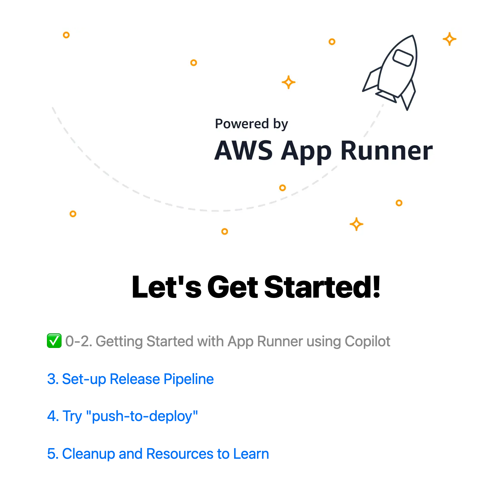

Let's open the first item: "Getting Started with App Runner using Copilot."

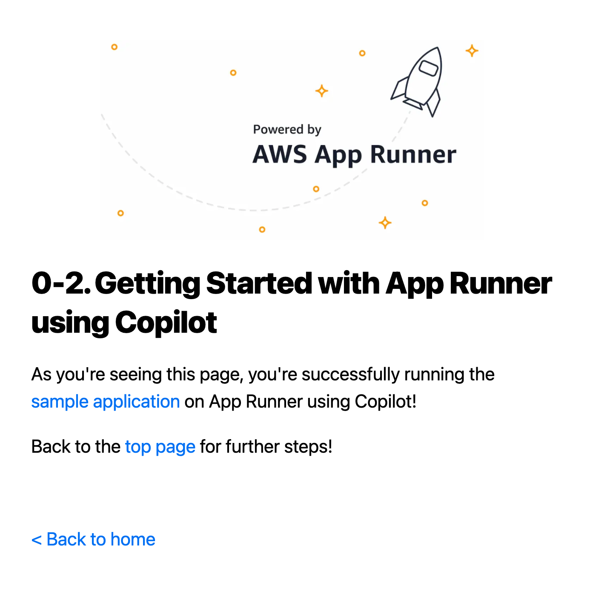

You'll see that the first item describes what you've just finished through this step-by-step guide.

So let's get back to the top page by clicking the "Back to home" link and open the second item "3. Set-up Release Pipeline" to go to the next step.

### 3. Set up the release pipeline

As described in the web page you just opened, you'll create a release pipeline in CodePipeline by using two Copilot commands.

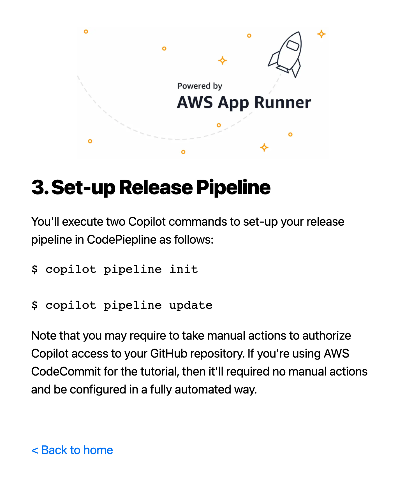

First, you execute the `copilot pipeline init` command to generate configuration files.

```bash
$ copilot pipeline init

Which environment would you like to add to your pipeline?: test
Which repository would you like to use for your pipeline?: https://github.com/<Your GitHub ID>/hello-app-runner-nodejs
```

<details>
  <summary>Show terminal outputs</summary>

```bash
✔ Wrote the pipeline manifest for hello-app-runner-nodejs at 'copilot/pipeline.yml'
The manifest contains configurations for your CodePipeline resources, such as your pipeline stages and build steps.
Update the file to add additional stages, change the branch to be tracked, or add test commands or manual approval actions.
✔ Wrote the buildspec for the pipeline's build stage at 'copilot/buildspec.yml'
The buildspec contains the commands to build and push your container images to your ECR repositories.
Update the build phase to unit test your services before pushing the images.

Required follow-up actions:
- Commit and push the buildspec.yml, pipeline.yml, and .workspace files of your copilot directory to your repository.
- Run `copilot pipeline update` to create your pipeline.
```

</details>

Let's take a look at the generated `./copilot/pipeline.yml`.

```
$ cat ./copilot/pipeline.yml

# This YAML file defines the relationship and deployment ordering of your environments.

# The name of the pipeline
name: pipeline-my-app-hello-app-runner-nodejs

# The version of the schema used in this template
version: 1

# This section defines the source artifacts.
source:
  # The name of the provider that is used to store the source artifacts.
  provider: GitHub
  # Additional properties that further specifies the exact location
  # the artifacts should be sourced from. For example, the GitHub provider
  # has the following properties: repository, branch.
  properties:
    branch: main
    repository: https://github.com/aws-containers/hello-app-runner-nodejs
    # Optional: specify the name of an existing CodeStar Connections connection.
    # connection_name: a-connection

# The deployment section defines the order the pipeline will deploy
# to your environments.
stages:
    - # The name of the environment to deploy to.
      name: test
      # Optional: flag for manual approval action before deployment.
      # requires_approval: true
      # Optional: use test commands to validate this stage of your build.
      # test_commands: [echo 'running tests', make test]
```

We don't edit this file in this tutorial, but for example, you can uncomment the test_commands line at the end of the file if you want to add some tests. See the [Copilot documentation](https://aws.github.io/copilot-cli/docs/manifest/pipeline/) for the detailed specifications.

Then, execute `copilot pipeline update` to create a pipeline in CodePipeline in your AWS account.

```bash
$ copilot pipeline update

✔ Successfully added pipeline resources to your application: my-app
```

Now you need to take manual actions as described in the following terminal output to allow CodePipeline to access your repository.

```bash
ACTION REQUIRED! Go to https://console.aws.amazon.com/codesuite/settings/connections to update the status of connection copilot-toric-hello-app-runner-n from PENDING to AVAILABLE.
```

Open [CodeSuite Connections](https://console.aws.amazon.com/codesuite/settings/connections) in the console your web browser’s new tab that is already signed in to your AWS account.

Click the connection name to go to the detailed view.

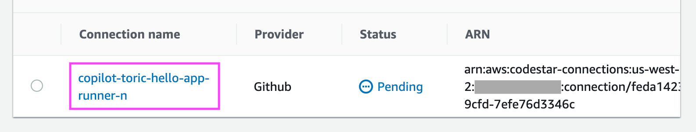

Click the "Update pending connection" button then you'll see a popup window titled as "Connect to GitHub."


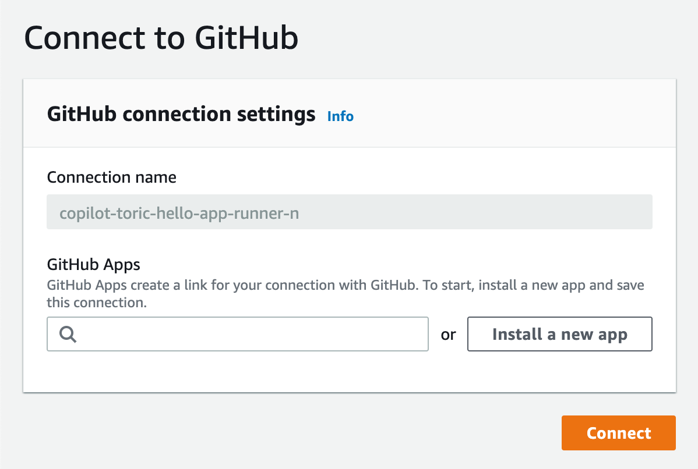

If you already have connected GitHub Apps, you'll see existing GitHub Apps in the dropdown menu, by putting the focus into the input next to the magnifier icon.

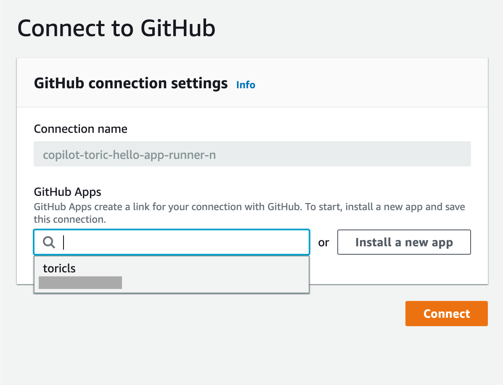

**I have an existing GitHub App that has access to the repository.**

Select one, and click "Connect" and go to the "Check Copilot's status" section below.

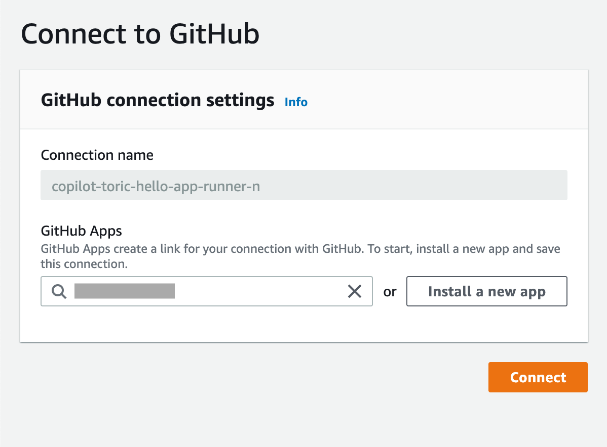

**I don't have any existing GitHub App with access to the repository.**

Click the "Install a new app" button then the window loads the GitHub web page to let you select your GitHub namespace that your forked repository belongs to.

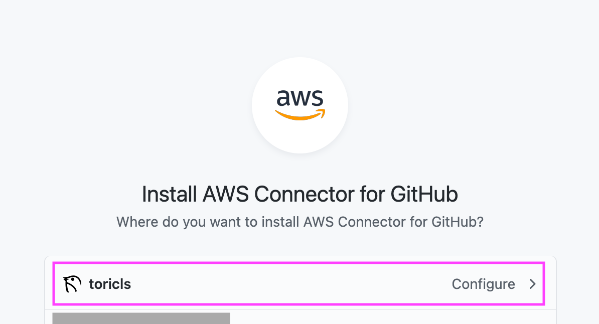

Once you selected the GitHub namespace, follow the web page to create or update a GitHub App to allow access to your GitHub repository. Note that you need to choose "hello-app-runner-nodejs" as a selected repository if you choose "Only select repositories" in the "Repository access" section on the GitHub App page.

You'll be redirected to the AWS Management Console again after clicking the "Save" button in the GitHub page.

Now the input has a numeric value, then click the "Connect" button.


**Check Copilot's status**

Go back to the terminal where you executed `copilot pipeline update`, it must show that you have successfully created a pipeline as follows.

```bash
✔ Successfully created a new pipeline: pipeline-my-app-hello-app-runner-nodejs

Recommended follow-up actions:
- Run `copilot pipeline status` to see the state of your pipeline.
- Run `copilot pipeline show` for info about your pipeline.
```

Now that you have a release pipeline created in CodePipeline, let’s click the "Back to home" link at the left bottom of the web page in the web application.

In the next step, we're going to try "push-to-deploy" by using the pipeline we've just created.

### 4. Try "push-to-deploy"

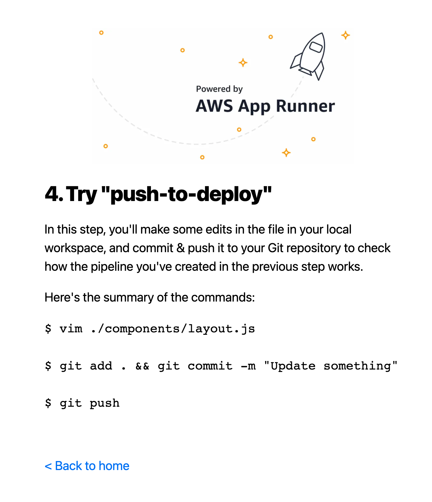

Let's edit something in the repository and push it to invoke the pipeline!

```bash
$ vim ./components/layout.js

# See the `topPageMessage` in the line 10 of the file, and change the text "Let's Get Started!" to whatever you'd like to see in the application.
# I choose "Happy building with App Runner and Copilot!" for it :)
```

Once you changed the text, save it and execute the following commands in the terminal window.

```bash
# NOTE:
## Ensure you're staging everything under the "copilot" directory,
## not only "./components/layout.js" file.
## The pipeline will fail in its build stage if those files are missing.
$ git add .

$ git commit -m "My first push-to-deploy with CodePipeline"

[main xxxxxxx] My first push-to-deploy with CodePipeline
 6 files changed, 265 insertions(+), 1 deletion(-)
 create mode 100644 copilot/.workspace
 create mode 100644 copilot/buildspec.yml
 create mode 100644 copilot/my-svc/addons/Items.yml
 create mode 100644 copilot/my-svc/manifest.yml
 create mode 100644 copilot/pipeline.yml

$ git push

Enumerating objects: 15, done.
Counting objects: 100% (15/15), done.
Delta compression using up to 4 threads
Compressing objects: 100% (10/10), done.
Writing objects: 100% (12/12), 4.52 KiB | 1.51 MiB/s, done.
Total 12 (delta 2), reused 0 (delta 0), pack-reused 0
remote: Resolving deltas: 100% (2/2), completed with 2 local objects.
To https://github.com/<Your GitHub ID>/hello-app-runner-nodejs.git
   xxxxxxx..yyyyyyy  main -> main
```

All set! Go to CodePipeline in the console at `https://<Your AWS region>.console.aws.amazon.com/codesuite/codepipeline/pipelines` in your web browser’s new tab and open the pipeline in the list. You'll see something like below.

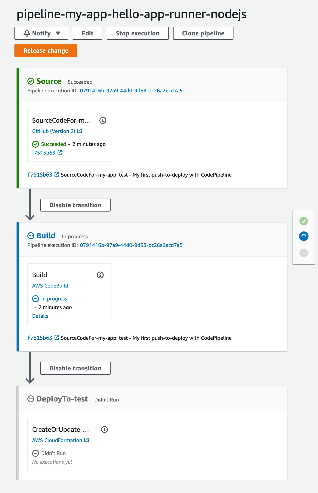

Wait a few minutes for the pipeline to be successfully completed all the stages, then click the the "Back to home" link at the left bottom of the web page in the web application. It’ll bring you to the top page.

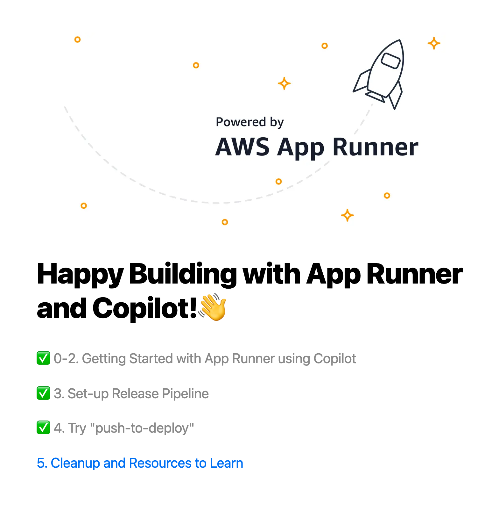

Congratulations 🎉 As you can see, the change we’ve made were successfully deployed through the pipeline!

Now you have a configurable continuous delivery pipeline that can be invoked by GitHub push. We can push additional commits to see how the sample app works.

### 5. Cleanup

This is the final (and is optional but important) step. You may want to delete all the provisioned resource to avoid unexpected charges.

With Copilot, it's also easy to wipe out everything you've created by this tutorial in your AWS account. To do this, execute the following command.

```bash
$ copilot app delete --name my-app --yes
```

<details>
  <summary>Show terminal outputs</summary>

```bash
✔ Deleted service my-svc from environment test.
✔ Deleted resources of service my-svc from application my-app.
✔ Deleted service my-svc from application my-app.
✔ Deleted environment test from application my-app.
✔ Cleaned up deployment resources.
✔ Deleted pipeline pipeline-my-app-hello-app-runner-nodejs from application my-app.
✔ Deleted application resources.
✔ Deleted application configuration.
✔ Deleted local .workspace file.
```

</details>

That's all!

## Resources to learn more

There are more resources to learn more about AWS App Runner and AWS Copilot CLI, and we encourage you to check out them!

- [Introducing AWS App Runner | Containers](https://aws.amazon.com/blogs/containers/introducing-aws-app-runner/)
- [AWS Copilot Documentation](https://aws.github.io/copilot-cli)
- [AWS App Runner Documentation](https://docs.aws.amazon.com/apprunner)
- [AWS App Runner Workshop](https://apprunnerworkshop.com)
- ✨ [AWS App Runner Public Roadmap at GitHub](https://github.com/aws/apprunner-roadmap/projects/1) ✨ - See the latest roadmap items, and leave your requests and feedback to the App Runner team directly!

Happy building with App Runner and Copilot! 👋

## In case you also want to try App Runner's managed pipeline

You may also want to try App Runner's managed pipeline after the turorial above.

In this case, open the [App Runner management console](https://console.aws.amazon.com/apprunner/home) and `Create service` with the following properties.

> Note that the DynamoDB table and the IAM role below are created in the tutorial.

- Runtime - `Nodejs 12`
- Build command - `npm install && npm run build && ./seed/seed-img.sh`
- Start command - `npm start`
- Port - `80`
- Environment variable - `ITEMS_NAME=<Your DynamoDB table name>`
- Security > Instance role - `my-app-test-my-svc-InstanceRole-XXXXXXXXXXXXX`

## Security

See [CONTRIBUTING](CONTRIBUTING.md#security-issue-notifications) for more information.

## License

Licensed under the MIT-0 License. See the [LICENSE](LICENSE) file.
